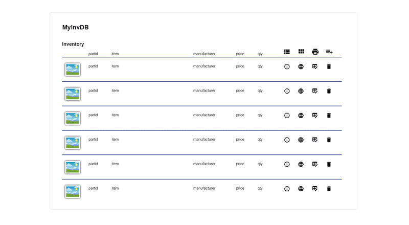
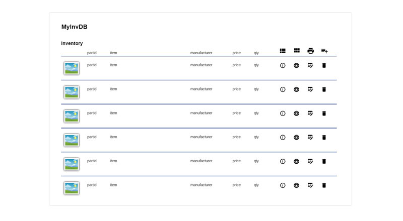
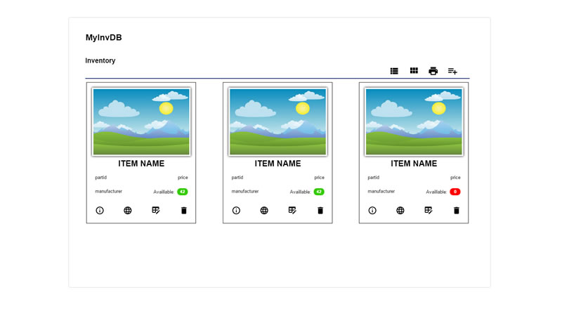
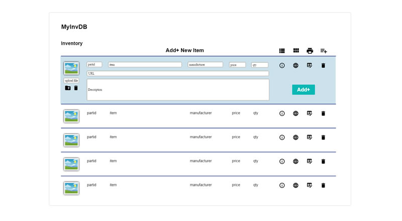
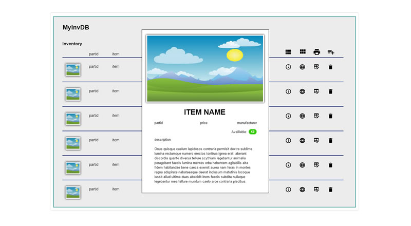
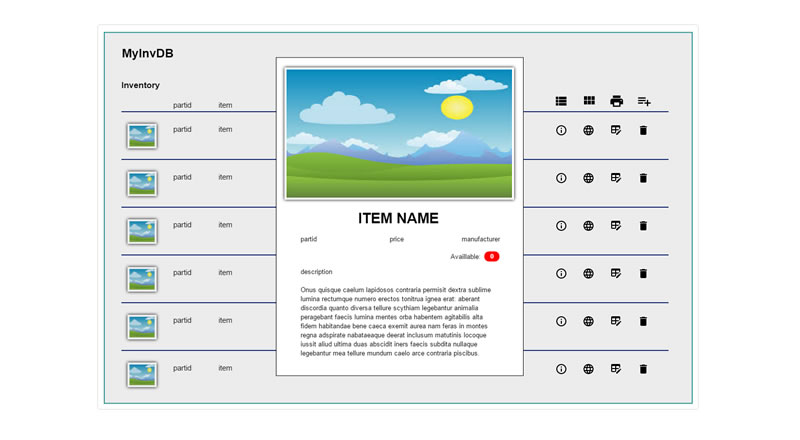

# MyInvDB, a simple inventory app

MyInvDB uses PHP, MySQL and Botstrap 4


**Currently Working On:**
Coding the index and logic pages, the README is in a working state.

## Project Status - In Mid-Project State / Last Updated: 12/03/2019

---

## Table of Contents

- MyInvDB App Description

- Features to Have

- Website Technologies

- The Build Process

- How to Use This App

- File and Directory Structure

- Revision History

- Resources

---

### MyInvDB App Description

more to come

---

### Features to Have

- Basic CRUD app (Create, Read, Update, Delete) of inventory products

- Display products in either a list or card view

- Upload images and be available to display in list view, card view and detail view

- Link to the Manufacturers website product information page for each product when available

- Print inventory list as a pdf or send to printer

---

### Website Technologies

Description of website technologies used to develop this app.

- PHP

- MySQL database

- Bootstrap 4.0

- Font Awesome

---

### The Build Process

Description of how this project was started and the process of putting it together.

As with any project planning is always a good thing to help make your work flow go smooth and not over look things if possible. I started with a few pieces of paper and scribbled away for a little while and came up with my initial wireframe then moved on to use [Evolus Pencil](http://pencil.evolus.vn) to make a better looking version.

#### Wireframe of the Project

|  |                |                              |
| :------------------------------------------------------------: | :--------------------------------------------------------------------------: | :------------------------------------------------------------------------------: |
|             |  |  |

A [PDF file](readme_assets/MyInvDB-Wireframe.pdf) and All of the large images that make up the wireframe are available for viewing or download in the readme_assets folder.

On to creating the procedures list for coding out the app.

(procedures coming here)

Setting up the MySQL database is next on my list, use MyPHPAdmin to create a new database with the name "_myinvdb_" and a table called "_items_" and populate the database with a few seeds (data). I used [MySQL Workbench](https://www.mysql.com/products/workbench/) and ran a couple sql script to create the database, table and populate the database (you will find those files in the db folder). I will not be covering how to setup your working environment or how to use [MySQL Workbench](https://www.mysql.com/products/workbench/) in this project.

(discuss creation process coming here)

Moving forward to setting up the files and directory structur (seen below)

(procedures coming here)

Coding! Here We Go! Starting to Code!

(more to be coming here)

---

### How to Use This App

Description of how to use the app

more to come.

---

### File and Directory Structure

```tree
.
├── css
│   │
│   └── style.css
│
├── db
│   │
│   ├── schema.sql
│   │
│   └── seeds.sql
│
├── images
│   │
│   ├── bg.jpg
│   │
│   ├── favicon.ico
│   │
│   ├── logo-30.png
│   │
│   ├── logo-40.png
│   │
│   ├── logo-75.png
│   │
│   └── logo.png
│
├── includes
│   │
│   ├── bottom_nav.html
│   │
│   ├── copyright.php
│   │
│   └── top_nav.html
│
├── logic
│   │
│   ├── actions.php
│   │
│   └── config.php
│
├── readme_assets
│   │
│   ├── myinvdb_add.jpg
│   │
│   ├── myinvdb_edit.jpg
│   │
│   ├── myinvdb_home_card_view.jpg
│   │
│   ├── myinvdb_home_detailed_info_available.jpg
│   │
│   ├── myinvdb_home_detailed_info_not_available.jpg
│   │
│   ├── myinvdb_home_list_view.jpg
│   │
│   ├── MyInvDB-Procedures.pdf
│   │
│   ├── MyInvDB-Wireframe.pdf
│   │
│   └── myinvdb.gif
│
├── uploads
│   │
│   ├── 189.jpg
│   │
│   ├── 326.jpg
│   │
│   ├── 3046.jpg
│   │
│   ├── 3591.jpg
│   │
│   ├── 3686.jpg
│   │
│   ├── 3898.jpg
│   │
│   └── 4007.jpg
│
├── webfonts
│   │
│   ├── fa-brands-400.eot
│   │
│   ├── fa-brands-400.svg
│   │
│   ├── fa-brands-400.ttf
│   │
│   ├── fa-brands-400.woff
│   │
│   ├── fa-brands-400.woff2
│   │
│   ├── fa-regular-400.eot
│   │
│   ├── fa-regular-400.svg
│   │
│   ├── fa-regular-400.ttf
│   │
│   ├── fa-regular-400.woff
│   │
│   ├── fa-regular-400.woff2
│   │
│   ├── fa-solid-900.eot
│   │
│   ├── fa-solid-900.svg
│   │
│   ├── fa-solid-900.ttf
│   │
│   ├── fa-solid-900.woff
│   │
│   └── fa-solid-900.woff2
│
│
├── .gitignore
│
├── about.php
│
├── index.php
│
└── README.md
```

---

### Revision History

Description of revisions made to the app - **App Last Updated Date: 12/03/2019**

- [x] Dev - File and directory structure creation started
- [x] Dev - Database schema.sql and seeds.sql created
- [x] Dev - Website wireframing
- [x] Dev - MySQL database setup
- [ ] Dev - Website coding
- [ ] Dev - File and directory structure cleanup
- [ ] Dev - Final testing

---

### Resources

Resources used for this app

- [Evolus Pencil](http://pencil.evolus.vn/)
- [MySQL Workbench](https://www.mysql.com/products/workbench/)
- [WampServer](http://www.wampserver.com/)
